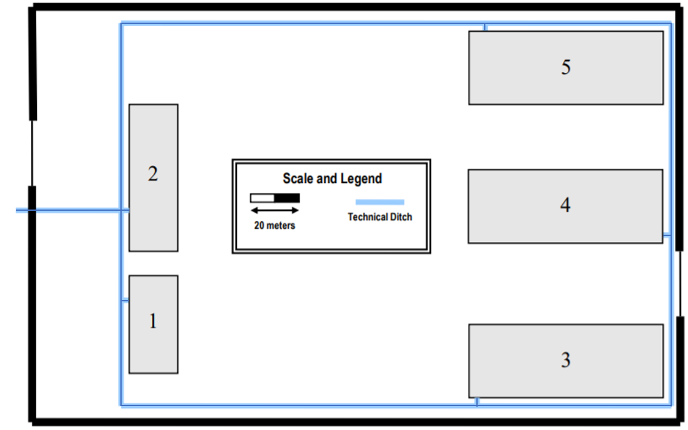
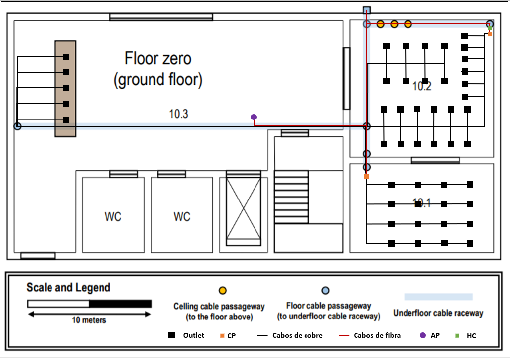
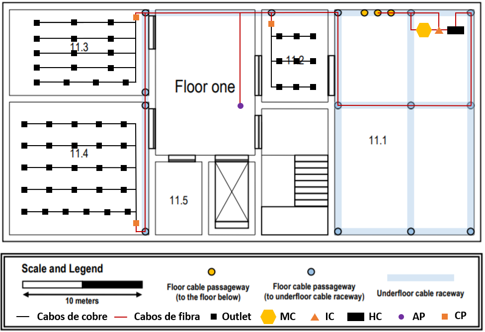

RCOMP 2019-2020 Project - Sprint 1 - Member 1190429 folder
===========================================

# Campus #

A ligação entre os diferentes edifícios é feita a partir do edifício 1 que tem o MC, distribuindo a rede para os restantes edifícios.

De forma a ser possível alcançar a redundância de cabos foram estabelecidas as seguintes ligações entre os edifícios:

* Edifício 1 para 2, onde o total de cabo corresponde a 43,08 metros.
* Edifício 1 para 3, onde o total de cabo corresponde a 193,08 metros.
* Edifício 1 para 4, onde o total de cabo corresponde a 343,08 metros.
* Edifício 1 para 5, onde o total de cabo corresponde a 266,92 metros.
* Edifício 2 para 5, onde o total de cabo corresponde a 230,00 metros.
* Edifício 4 para 5, onde o total de cabo corresponde a 167,69 metros.
* Edifício 1 para 5, onde o total de cabo corresponde a 193,08 metros.

Ligação para o edifício 1 tem aproximadamente 83,08 metros, logo no total, o backbone do campus tem cerca de 1520,00 metros. 

As ligações anteriormente referidas são de fibra ótica monomodo, uma vez que é imune à dispersão e, por isso, permite taxas de dados mais altas e especialmente comprimentos de cabo mais longos.

Todas as medições tiveram em conta a escala representada na imagem. Consideramos que 20 metros correspondem a 1,30 centímetros.

Nota: linha representada a azul diz respeito à cablagem dupla de fibra ótica.

# Piso 0 #

#### Medidas ####

| Sala | Comprimento (cm) | Largura (cm) | Comprimento Real (m) | Largura Real (m) | Área (m²) | Outlets |
|:----------:|:----------:|:----------:|:---------:|:---------:|:---------:|:----------:|
| 10.1 | 3,90 | 2,40 | 11,4706 | 7,059 | 80,971 | 16 |
| 10.2 | 3,90 | 3,90 | 11,4706 | 11,4706 | 131,575 | 26 |
| 10.3 |----------|----------|----------|----------|----------| 5 |

Todas as medições tiveram em conta a escala representada na imagem. Consideramos que 10 metros correspondem a 3,40 centímetros.

De forma a calcular o número de outlets por área, foi seguida a regra que refere que por 10 metros quadrados têm que existir 2 outlets em todas as salas deste piso.

Na sala 10.1 como tem 80,971 m², serão necessários 16 outlets que foram distribuídos neste espaço tendo em conta que tem que existir sempre um outlet a menos de três metros de distância.

Foi instalado neste espaço um CP devido ao número elevado de outlets, com formato de rack de 19'', um patch panel de 24 portas e um switch de 24 portas.

Na sala 10.2 como tem 131,575 m², serão necessários 26 outlets que foram distribuídos neste espaço tendo em conta que tem que existir sempre um outlet a menos de três metros de distância. 

Neste espaço, também foram colocados o HC que cobre a área total do piso, com formato de rack de 19'', um patch panel de 12 portas, sendo utilizadas 2 portas para o IC e as restantes para cada CP do piso e um switch de 12 portas.

Para além do HC, foi instalado um CP devido ao número elevado de outlets, com formato de rack de 19'', um patch panel de 48 portas e um switch de 48 portas. 

Na sala 10.3 tal como referia no enunciado foram colocados 5 outlets na mesa que foram distribuídos neste espaço tendo em conta que tem que existir sempre um outlet a menos de três metros de distância.

Para além dos outlets, como podemos observar na imagem acima representada foi instalado um AP no centro deste piso para que exista cobertura WiFi em toda a sua área. 
Para perceber o número de AP a colocar no piso, usamos um raio 25 metros. 
Como este piso tem as dimensões 40 x 20 metros, um AP por piso chega para assegurar a cobertura WiFi na área do piso.

#### Inventário ####
* 1 HC
    * 1 Patch Panel de 12 portas
    * 1 Switch de 12 portas
* 2 CP
    * 1 Patch Panel de 24 portas
    * 1 Switch de 24 portas
    * 1 Patch Panel de 48 portas
    * 1 Switch de 48 portas
* 1 AP
* 47 Outlets
* 717,66 metros de cabo CAT6A

# Piso 1 #

#### Medidas ####

| Sala | Comprimento (cm) | Largura (cm) | Comprimento Real (m) | Largura Real (m) | Área (m²) | Outlets |
|:----------:|:----------:|:----------:|:---------:|:---------:|:---------:|:----------:|
| 11.1 | 6,50| 4,00 | 19,118 | 11.765 | 224.923| 0 |
| 11.2 | 2,70 | 1,90| 7.941 | 5.588 | 44,374 | 9 |
| 11.3 | 4,00 | 2,50 |11,765 | 7.353 | 86,508 | 17 |
| 11.4 | 4,00 | 3,80 | 11,765 | 11,176 | 131,486 | 26 |
| 11.5 | 2,10 | 1,30 | 6,176 | 3,824 | 23,617 | 0 |

Todas as medições tiveram em conta a escala representada na imagem. Consideramos que 10 metros correspondem a 3,40 centímetros.

De forma a calcular o número de outlets por área, foi seguida a regra que refere que por 10 metros quadrados têm que existir 2 outlets em todas as salas deste piso.

Tal como o enunciado refere a sala 11.1 é o datacenter do campus, logo foram instalados nesta sala um MC, um IC e um HC.

O MC tem um formato de rack de 19'', um patch panel de 12 portas, sendo utilizadas 2 portas para cada IC de cada edifício e um switch de 12 portas.

O IC tem um formato de rack de 19'', um patch panel de 8 portas, sendo utilizadas 2 portas para cada HC do edifício e para o MC e um switch de 8 portas.

O HC tem um formato de rack de 19'', um patch panel de 12 portas, sendo utilizadas 2 portas para o IC e as restantes para cada CP do piso e um switch de 12 portas.

Na sala 11.2 como tem 44,374 m², serão necessários 9 outlets que foram distribuídos neste espaço tendo em conta que tem que existir sempre um outlet a menos de três metros de distância.

Foi instalado neste espaço um CP devido ao número elevado de outlets, com formato de rack de 19'', um patch panel de 24 portas e um switch de 24 portas.

Na sala 11.3 como tem 86,508 m², serão necessários 17 outlets que foram distribuídos neste espaço tendo em conta que tem que existir sempre um outlet a menos de três metros de distância.

Foi instalado neste espaço um CP devido ao número elevado de outlets, com formato de rack de 19'', um patch panel de 24 portas e um switch de 24 portas.

Na sala 11.4 como tem 131,486 m², serão necessários 26 outlets que foram distribuídos neste espaço tendo em conta que tem que existir sempre um outlet a menos de três metros de distância.

Foi instalado neste espaço um CP devido ao número elevado de outlets, com formato de rack de 19'', um patch panel de 48 portas e um switch de 48 portas.

No centro deste piso foi colocado também um AP de forma a garantir a cobertura de WiFi em toda a sua área. 
Para perceber o número de AP a colocar no piso, usamos um raio 25 metros. 
Como este piso tem as dimensões 40 x 20 metros, um AP por piso chega para assegurar a cobertura WiFi na área do piso.

#### Inventário ####
* 1 MC
    * 1 Patch Panel de 12 portas
    * 1 Switch de 12 portas
* 1 IC
    * 1 Patch Panel de 8 portas
    * 1 Switch de 8 portas
* 1 HC
    * 1 Patch Panel de 12 portas
    * 1 Switch de 12 portas
* 3 CP
    * 3 Patch Panel de 24 portas
    * 3 Switch de 24 portas
* 1 AP
* 52 Outlets
* 384,48 metros de cabo CAT6A

Nota: Toda a cablagem de fibra ótica refere-se à cablagem dupla de fibra ótica monomodo de modo a prevenir o sistema contra falhas de cabos.

Os cabos de cobre usados são CAT6A, visto que cobrem sinais de frequência até 500MHz, são capazes de transmitir sinais até 10Gbps. O cabo CAT6A é usado para suportar taxas de dados em 100 metros.