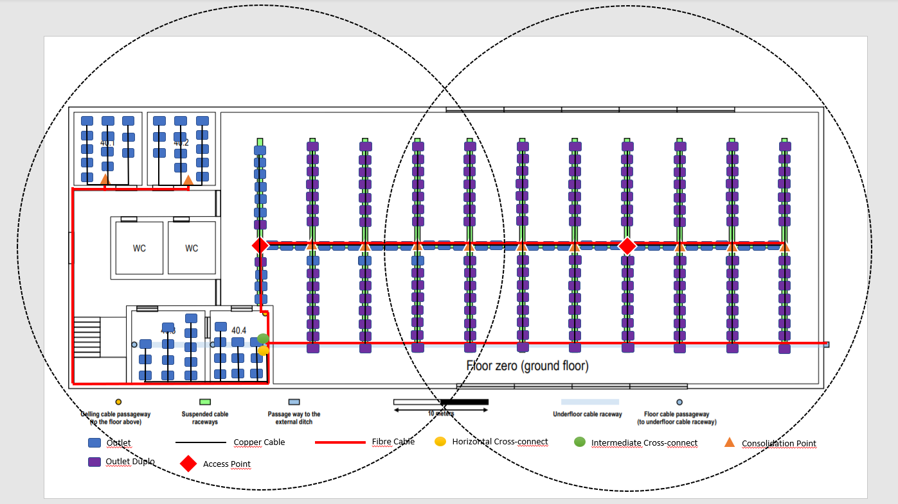
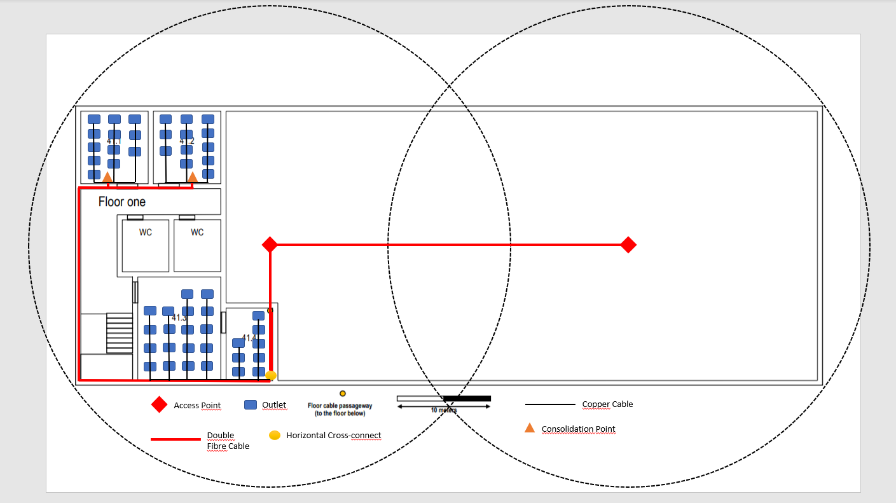

RCOMP 2020-2021 Project - Sprint 1 - Member 1190769 folder
===========================================

# Piso 0 #

### Medidas ###

Todas as medidas realizadas neste piso tiveream em a conta a escala de:
Cada 1.8 cm medidos, corresponde a 10 m.

Feito o cáluclo das áreas, foi calculado também o número de outlets em cada área tendo em conta que
a cada 10 metros quadrados seriam colocados 2 outlets.

Após os cálculos foi possível obter a seguinte tabela:

| Sala | Comprimento (m) | Largura (m) | Área (m²) | Outlets |
|:----------:|:---------:|:---------:|:----------:|:---------:|
| 40.1 | 7,222 | 7,222 | 52,157 | 12 |
| 40.2 | 7,222 | 7,222 | 52,157 | 12 |
| 40.3 | 7,778 | 7,222 | 56,173 | 12 |
| 40.4 | 7,778 | 6,111 | 47,531 | 10 |
| Right Area | N/A | N/A | 1694,400 | 340 |

Devido ao facto de a área direita não ser um retângulo perfeito,
este foi dividido em dois retângulos e somaram-se as áreas de ambos.

Na sala 40.1 como tem 52,157 m², serão necessários 12 outlets.
Foi instalado neste espaço um CP devido ao número elevado de outlets, com formato de rack de 10'', um patch panel de 12 portas de tamanho 1U e um switch de 12 portas de tamanho 1U.
Será, então, necessário um gabinete de 6U.

Na sala 40.2 como tem 52,157 m², serão necessários 12 outlets.
Foi instalado neste espaço um CP devido ao número elevado de outlets, com formato de rack de 10'', um patch panel de 12 portas de tamanho 1U e um switch de 12 portas de tamanho 1U.
Será, então, necessário um gabinete de 6U.

Na sala 40.3 como tem 56,173 m², serão necessários 12 outlets.

Na sala 40.4 como tem 47,531 m², serão necessários 10 outlets.
Esta é a sala de telecomunicações do edifício, uma vez que é nessa sala que entrarão os cabos de fibra de ótica monomodo provenientes do exterior e é a partir dessa sala que os cabos passarão para o andar de cima.
Por esa razão, foi instalado neste espaço um HC, com formato de rack de 19'', um patch panel de 24 portas de tamanho 1U e um switch de 24 portas de tamanho 1U. 
Será, então, necessário um gabinete de 6U.

Neste espaço foi também coloca um IC, com formato de rack de 10'', um patch panel de 12 portas de tamanho 1U e um switch de 12 portas de tamanho 1U.
Será necessário mais um gabinete de 6U.

Na área da direita como tem 1694,400 m², serão necessários 340 outlets.
Foram instalados neste espaço 11 CPs devido ao número elevado de outlets, com formato de rack de 19'', 11 patch panels de 48 portas de tamanho 2U e 11 switches de 48 portas de tamanho 2U.
Serão, então, necessários 11 gabinetes de 12U.

Toda a distribuição de outlets feita no piso foi realizada tendo em conta que tem que existir sempre um outlet a menos de três metros de distância.
Neste piso foram também colocados 2 Access Points com raio de 25 metros ligados com cabos de fibra, de forma a ser possível cobrir todo o piso.
Cada um dos Access Points está sintonizado num canal diferente de forma a evitar conflitos entre ambos.

### Inventário ###
* 1 HC
    * 1 Patch Panel de 24 portas
    * 1 Switch de 24 portas
* 1 IC
    * 1 Patch Panel de 12 portas
    * 1 Switch de 12 portas
* 13 CP
    * 2 Patch Panels de 12 portas
    * 2 Switches de 12 portas
    * 11 Patch Panels de 48 portas
    * 11 Switches de 48 portas
* 2 AP
* 386 Outlets
* 386 cabos de cobre CAT6A
* 2305,715 metros de cabo CAT6A
* 34 cabos de fibra
* 1307,572 metros de fibra
* 386 Patch Cords (ISO8877 connectors (RJ45)) de 3 metros

**Notas**: Toda a cablagem de fibra ótica neste piso refere-se à cablagem dupla de fibra ótica monomodo de modo a prevenir o sistema contra falhas de cabos, permitir taxas de dados mais altas e especiamlmente comprimentos de cabo mais longos e é também imune à dispersão.

Todas as medidas de cabos realizadas neste piso tiveream em a conta a escala de:
Cada 2.8 cm medidos, corresponde a 10 m

# Piso 1 #

### Medidas ###

Todas as medidas realizadas neste piso tiveream em a conta a escala de:
Cada 1.8 cm medidos, corresponde a 10 m.

Feito o cáluclo das áreas, foi calculado também o número de outlets em cada área tendo em conta que
a cada 10 metros quadrados seriam colocados 2 outlets.

Após os cálculos foi possível obter a seguinte tabela:

| Sala | Comprimento Real (m) | Largura Real (m) | Área (m²) | Outlets |
|:----------:|:---------:|:---------:|:----------:|:---------:|
| 41.1 | 7,222 | 7,222 | 52,157 | 12 |
| 41.2 | 7,222 | 7,222 | 52,157 | 12 |
| 41.3 | 10,556 | 8,333 | 87,963 | 18 |
| 41.4 | 7,222 | 5,000 | 36,110 | 8 |
| Right Area | N/A | N/A | N/A | 0 |

Como a área da direita é uma open area, não é necessária a existência de outlets.

Na sala 41.1 como tem 52,157 m², serão necessários 12 outlets.
Foi instalado neste espaço um CP devido ao número elevado de outlets, com formato de rack de 10'', um patch panel de 12 portas de tamanho 1U e um switch de 12 portas de tamanho 1U.
Será, então, necessário um gabinete de 6U.

Na sala 41.2 como tem 52,157 m², serão necessários 12 outlets.
Foi instalado neste espaço um CP devido ao número elevado de outlets, com formato de rack de 10'', um patch panel de 12 portas de tamanho 1U e um switch de 12 portas de tamanho 1U.
Será, então, necessário um gabinete de 6U.

Na sala 41.3 como tem 87,963 m², serão necessários 18 outlets.

Na sala 41.4 como tem 36,110 m², serão necessários 8 outlets.
Nesta sala também foram instalados um HC, com formato de rack de 19'', um patch panel de 48 portas com tamanho 2U e um switch de 48 portas de tamanho 2U de forma a poder fazer as conexões aos outlets
das salas 41.3 e 41.4.
Será, então, necessário um gabinete de 12U.

Toda a distribuição de outlets feita no piso foi realizada tendo em conta que tem que existir sempre um outlet a menos de três metros de distância.
Neste piso foram também colocados 2 Access Points com raio de 25 metros ligados com cabos de fibra, de forma a ser possível cobrir todo o piso.
Cada um dos Access Points está sintonizado num canal diferente de forma a evitar conflitos entre ambos.

**Nota**: Apesar de não serem visíveis, 2 dos CPs encontram-se por baixo dos 2 access points no esquema, no entanto não se encontram à mesma altura.

### Inventário ###
* 1 HC
    * 1 Patch Panel de 48 portas
    * 1 Switch de 48 portas
* 2 CP
  * 2 Patch Panels de 12 portas
  * 2 Switches de 12 portas
* 2 AP
* 50 Outlets
* 50 cabos de cobre CAT6A
* 411,965 metros de cabo CAT6A
* 10 cabos de fibra
* 325,572 metros de fibra
* 50 Patch Cords (ISO8877 connectors (RJ45)) de 3 metros

**Notas**: Toda a cablagem de fibra ótica neste piso refere-se à cablagem dupla de fibra ótica monomodo de modo a prevenir o sistema contra falhas de cabos, permitir taxas de dados mais altas e especiamlmente comprimentos de cabo mais longos e é também imune à dispersão.

Todas as medidas de cabos realizadas neste piso tiveream em a conta a escala de:
Cada 2.8 cm medidos, corresponde a 10 m

# Inventário Total #

* 2 HC
  * 1 Patch Panel de 48 portas
  * 1 Switch de 48 portas
    * 1 Patch Panel de 24 portas
    * 1 Switch de 24 portas
* 1 IC
    * 1 Patch Panel de 8 portas
    * 1 Switch de 8 portas
* 15 CP
  * 2 Patch Panel de 12 portas
  * 2 Switch de 12 portas
* 4 AP
* 436 Outlets
* 436 cabos de cobre CAT6A
  * 2717,68 metros de cabo CAT6A
* 44 cabos de fibra
  * 1633,144 metros de fibra
* 436 Patch Cords (ISO8877 connectors (RJ45)) de 3 metros