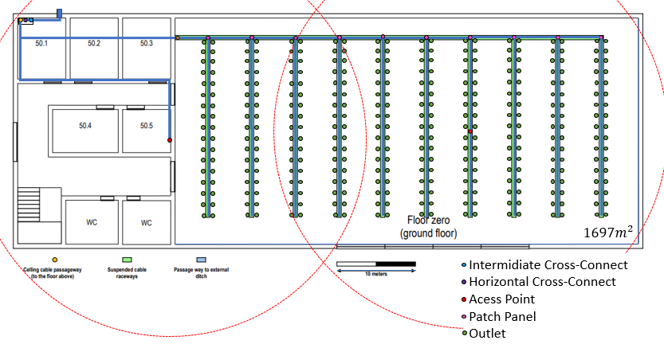
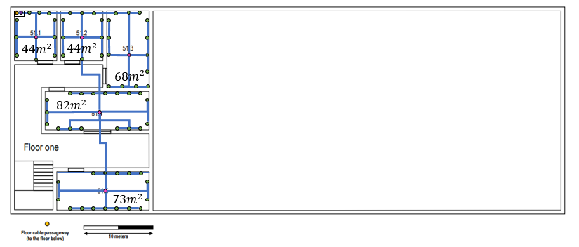

RCOMP 2019-2020 Project - Sprint 1 - Member 1190800 folder
===========================================
# Building 5

## Ground Floor

---
## Floor One

---
# Decisions 

## Access Point

* Access Point Locations - the positions of the access points were chosen to ensure full Wi-fi coverage on the floor and avoid interferences and overlappings(This was a 3 dimensions problem). Range: 25 meters (radius)

## Cables Types

* Backbones are made from fibre. The rest of the connections are made from copper wires.

## Cross-Connects Locations
* Not having a appropriate location to place the cross-connects, they must be kept in a room inside an appropriate cabinet.