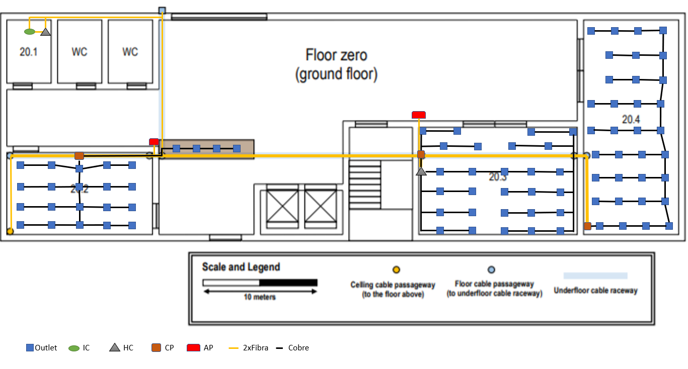
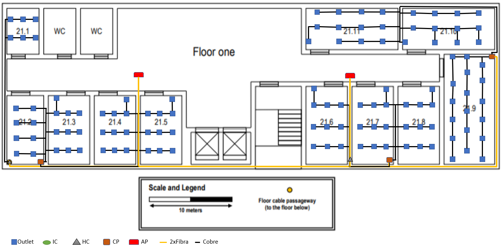

RCOMP 2020-2021 Project - Sprint 1 - Member 1190974 folder
===========================================

# Piso 0 #

#### Medidas ####

| Sala | Comprimento (cm) | Largura (cm) | Comprimento Real (m) | Largura Real (m) | Área (m²) | Outlets |
|:----------:|:----------:|:----------:|:----------:|:----------:|:----------:|:----------:|
| 20.1 |:----------:|:----------:|:----------:|:----------:|:----------:|:----------:|
| 20.2 | 5,20 | 2,90 | 13,000 | 7,250 | 94,250 | 20 |
| 20.3 | 5,50 | 3,80 | 13,750 | 9,500 | 130,625 | 28 |
| 20.4 | 7,60 | 3,40 | 19,000 | 8,500 | 161,500 | 34 |
| Service Desk | 3,90 | 0,70 | 9,750 | 1,750 | 17,063 | 4 |

Todas as medições tiveram em conta a escala representada na imagem. Consideramos que 10 metros correspondem a 4,70 centímetros.

De forma a calcular o número de outlets por área, foi seguida a regra que refere que por 10 metros quadrados têm que existir 2 outlets em todas as salas deste piso.

Toda a cablagem de fibra ótica refere-se à cablagem dupla de fibra ótica monomodo de modo a prevenir o sistema contra falhas de cabos, permitir taxas de dados mais altas e especiamlmente comprimentos de cabo mais longos
e é também imune à dispersão.

Todos os outlets estão conectados aos CP ou HC por cabos CAT6A enquanto que a conexão entre IC e HC ou HC e CP está efetuada por cabos de fibra. 

Uma vez que a área do edifício é 1200 m² e cada HC cobre uma área perto de 1000 m² são necessários 2.

Neste piso, uma vez que não existe teto falso, os access points serão colocados juntos das paredes e em locais onde cobrem o piso todo tendo em conta o raio de 25 metros de cobertura ao ultrapassar obstáculos como paredes por exemplo.
Os access points possuem canais, consequentemente frequências diferentes para evitar interferência.

Os outlets foram colocados de forma a que existisse sempre um outlet a menos de três metros de distância em todas as salas em que são necessários outlets.

Na service desk como tem 17,063 m², serão necessários 4 outlets.

Na sala 20.1 como é uma área de armazenamento é uma zona ideal para colocar o IC e o um dos HC deste piso pois estão armazenados numa zona fora de acesso público.

Esta sala é também a TE, onde os equipamentos não ultrapassam os 50% do espaço de armazenamento providenciando espaço para melhorias no futuro.

O IC possui um formato de rack de 19'', um patch panel de 12 e um switch de 12.

O HC possui um formato de rack de 19'', um patch panel de 8 e um switch de 8.

Na sala 20.2 como tem 94,250 m², serão necessários 20 outlets e um CP devido ao elevado número de outlets que está conectado aos outlets desta sala e da service desk.

O CP possui um formato de rack de 19'', um patch panel de 48 e um switch de 48.

Na sala 20.3 como tem 130,625 m², serão necessários 28 outlets e está colocado também o 2º e último HC do piso conectado ao CP presente também nesta sala conectado aos outlets desta sala.

O HC possui um formato de rack de 19'', um patch panel de 8 e um switch de 8.

O CP possui um formato de rack de 19'' , um patch panel de 48 e um switch de 48.

Na sala 20.4 como tem 161,500 m², serão necessários 34 outlets e um CP devido ao elevado número de outlets.

O CP possui um formato de rack de 19'', um patch panel de 48 e um switch de 48.

#### Inventário ####

* CAT6A: 
  Comprimento: 847,255 m.
  Quantidade: 86 cabos.

* Fibra 
  Comprimento: 581,106 m.
  Quantidade: 20 cabos.

* IC: 1.
    * 1 Patch Panel de 12 portas
    * 1 Switch de 12 portas

* HC: 2.
    * 2 Patch Panel de 8 portas
    * 2 Switch de 8 portas

* CP: 3.
    * 3 Patch Panel de 48 portas
    * 3 Switch de 48 portas

* AP: 2.

* Outlets: 86.

* 86 Patch Cords ISO8877 connectors (RJ45) cada um com 3 m.

# Piso 1 #

#### Medidas ####

| Sala | Comprimento (cm) | Largura (cm) | Comprimento Real (m) | Largura Real (m) | Área (m²) | Outlets |
|:----------:|:----------:|:----------:|:----------:|:----------:|:----------:|:----------:|
| 21.1 | 2,20 | 1,50 | 5,500 | 4,000 | 22,000 | 6 |
| 21.2 | 3,30 | 1,80 | 8,250 | 4,500 | 37,125 | 8 |
| 21.3 | 3,30 | 2,00 | 8,250 | 5,000 | 41,250 | 10 |
| 21.4 | 3,30 | 2,00 | 8,250 | 5,000 | 41,250 | 10 |
| 21.5 | 3,30 | 2,00 | 8,250 | 5,000 | 41,250 | 10 |
| 21.6 | 3,80 | 2,00 | 9,500 | 5,000 | 47,500 | 10 |
| 21.7 | 3,80 | 2,00 | 9,500 | 5,000 | 47,500 | 10 |
| 21.8 | 3,80 | 2,00 | 9,500 | 5,000 | 47,500 | 10 |
| 21.9 | 5,40 | 2,50 | 13,500 | 6,250 | 84,375 | 18 |
| 21.10 | 4,50 | 2,00 | 11,250 | 5,000 | 56,250 | 12 |
| 21.11 | 4,50 | 2,00 | 11,250 | 5,000 | 56,250 | 12 |

Todas as medições tiveram em conta a escala representada na imagem. Consideramos que 10 metros correspondem a 4,70 centímetros.

De forma a calcular o número de outlets por área, foi seguida a regra que refere que por 10 metros quadrados têm que existir 2 outlets em todas as salas deste piso.

Toda a cablagem de fibra ótica refere-se à cablagem dupla de fibra ótica monomodo de modo a prevenir o sistema contra falhas de cabos, permitir taxas de dados mais altas e especiamlmente comprimentos de cabo mais longos
e é também imune à dispersão.

Todos os outlets estão conectados aos CP ou HC por cabos CAT6A enquanto que a conexão entre IC e HC ou HC e CP está efetuada por cabos de fibra. 

Uma vez que a área do edifício é 1200 m² e cada HC cobre uma área perto de 1000 m² são necessários 2.

Neste piso, uma vez que existe teto falso, os access points estão localizados em pontos onde cobrem o piso todo sem ser necessário estarem juntos às paredes graças ao teto falso
tendo em conta o raio de 25 metros de cobertura ao ultrapassar obstáculos como paredes por exemplo.
Os access points possuem canais, consequentemente frequências diferentes para evitar interferência.

Os outlets foram colocados de forma a que existisse sempre um outlet a menos de três metros de distância em todas as salas em que são necessários outlets.

Na sala 21.1 como tem 22 m² de área, serão necessários 6 outlets.

Na sala 21.2 como tem 37,125 m² de área, serão necessários 8 outlets e um CP para conectar os outlets das salas 21.3, 21.4 e 21.5.
Como é nesta sala está colocada a passagem dos cabos a partir do piso 0 está colocado um HC no teto falso dessa sala, que está conectado aos outlets da sala 21.1 por CAT6A.

O HC possui um formato de rack de 19'', 2 patch panel de 12 e 2 switch de 12.

O CP possui um formato de rack de 19'', um patch panel de 48 e um switch de 48.

Na sala 21.3 como tem 41,250 m² de área, serão necessários 10 outlets.

Na sala 21.4 como tem 41,250 m² de área, serão necessários 10 outlets.

Na sala 21.5 como tem 41,250 m² de área, serão necessários 10 outlets.

Na sala 21.6 como tem 47,500 m² de área, serão necessários 10 outlets.

Na sala 21.7 como tem 47,500 m² de área, serão necessários 10 outlets, possui um HC conectado ao CP presente entre a sala 21.6 e 21.7 
que conecta os outlets das salas 21.6, 21.7, 21.8 devido ao elevado somatório de outlets existentes nas salas.

O HC possui um formato de rack de 19'', um patch panel de 24 e um switch de 24.

O CP possui um formato de rack de 19'', um patch panel de 48 e um switch de 48.

Na sala 21.8 como tem 47,500 m² de área, serão necessários 10 outlets.

Na sala 21.9 como tem 84,375 m² de área, serão necessários 18 outlets e um CP que está conectado também aos outlets das salas 21.10 e 21.11 devido ao elevado somatório de outlets existentes nas salas.

O CP possui um formato de rack de 19'', um patch panel de 48 e um switch de 48.

Na sala 21.10 como tem 56,250 m² de área, serão necessários 12 outlets.

Na sala 21.11 como tem 56,250 m² de área, serão necessários 12 outlets.

#### Inventário ####

* CAT6A: 
  Comprimento: 1982,297 m.
  Quantidade: 116 cabos.

* Fibra 
  Comprimento: 419,272 m.
  Quantidade: 14 cabos.

* HC: 2.
    * 1 Patch Panel de 24 portas
    * 1 Switch de 24 portas
    * 2 Patch Panel de 12 portas
    * 2 Switch de 12 portas

* CP: 3.
    * 3 Patch Panel de 48 portas
    * 3 Switch de 48 portas

* AP: 2.

* Outlets: 116.

* 116 Patch Cords ISO8877 connectors (RJ45) cada um com 3 m.

#### Inventário Total Edifício B ####

* CAT6A: 
  Comprimento: 2829,552 m.
  Quantidade: 202 cabos.

* Fibra 
  Comprimento: 1000,378 m.
  Quantidade: 34 cabos.

* IC: 1.
    * 1 Patch Panel de 12 portas
    * 1 Switch de 12 portas

* HC: 4.
    * 1 Patch Panel de 24 portas
    * 1 Switch de 24 portas
    * 2 Patch Panel de 12 portas
    * 2 Switch de 12 portas
    * 2 Patch Panel de 8 portas
    * 2 Switch de 8 portas

* CP: 6.
    * 6 Patch Panel de 48 portas
    * 6 Switch de 48 portas

* AP: 4.

* Outlets: 202.

* 202 Patch Cords ISO8877 connectors (RJ45) cada um com 3 m.

Nota: Os cabos de cobre usados são CAT6A, visto que cobrem sinais de frequência até 500MHz, são capazes de transmitir sinais até 10Gbps. O cabo CAT6A é usado para suportar taxas de dados em 100 metros.