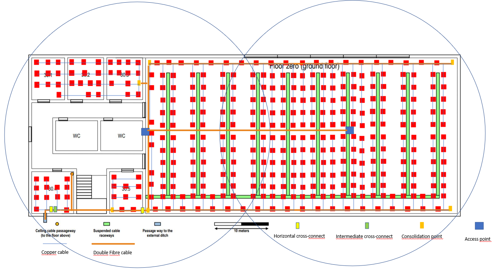

RCOMP 2020-2021 Project - Sprint 1 - Member 1191098 folder
===========================================

#### This is just an example for a team member with number 1191098 ####
### Each member should create a folder similar to this, matching his/her number. ###
The owner of this folder (member number 1191098) will commit here all the outcomes (results/artifacts/products)		       of his/her work during sprint 1. This may encompass any kind of standard file types.

# Piso 0 #

#### Medidas ####

| Sala | Comprimento (cm) | Largura (cm) | Comprimento Real (m) | Largura Real (m) | Área (m²) | Outlets |
|----------|----------|----------|---------|---------|---------|----------|
| 30.1 | 1,40 | 1,10 | 7,778 | 6,111 | 47,531 | 10 |
| 30.2 | 1,40 | 1,20 | 7,778 | 6,667 | 51,856 | 12 |
| 30.3 | 1,40 | 1,20 | 7,778 | 6,667 | 51,856 | 12 |
| 30.4 | 1,40 | 1,40 | 7,778 | 7,778 | 60,497 | 12 |
| 30.5 | 1,40 | 1,10 | 7,778 | 6,111 | 47,531 | 10 |
| Open Area | 10,10 | 5 | 56,111 | 27,778 | 1558,483 | 312 |

Todas as medições tiveram em conta a escala representada na imagem. Consideramos que 10 metros correspondem a 3,3 centímetros. De forma a calcular o número de outlets por área, foi seguida a regra que refere que têm de existir 2 outlets em todas as salas deste piso.

Como a sala 30.1 tem 47,531 m² de área, são necessários 10 outlets que foram distribuídos neste espaço tendo em conta que tem que existir sempre um outlet a menos de três metros de distância. 
Cada um destes 10 outlets está ligado a um CP instalado na sala 30.3.

Como a sala 30.2 tem 51,856 m² de área, são necessários 12 outlets que foram distribuídos neste espaço tendo em conta que tem que existir sempre um outlet a menos de três metros de distância.
Cada um destes 12 outlets está ligado a um CP instalado na sala 30.3.

Como a sala 30.3 tem 51,856 m² de área, são necessários 12 outlets que foram distribuídos neste espaço tendo em conta que tem que existir sempre um outlet a menos de três metros de distância.
Foram colocados neste espaço um CP, devido ao número elevado de outlets existentes nesta zona (salas 30.1, 30.2, 30.3), com formato de formato de rack de 19'', um patch panel de 48 portas e um switch de 48 portas.

A sala 30.4 é a sala de telecomunicações do piso, uma vez que é nessa sala que entrarão os cabos de fibra provenientes do exterior e é a partir dessa sala que os cabos passarão para o andar de cima. Assim, nesta sala foi colocado o IC do piso, assim como um dos HC's, para cobrir a área do lado esquerdo do edifício.
Como esta sala tem 60,497 m² de área, são necessários 12 outlets que foram distribuídos neste espaço tendo em conta que tem que existir sempre um outlet a menos de três metros de distância. 
Nesta sala foi ainda colocado, com formato de 19'', um patch panel de 24 portas, sendo que 2 portas são utilizadas para o IC, 1 para um CP da sala 30.5, 1 para o HC da área do lado direito do edifício e 12 para os outlets da sala 30.4, e ainda um switch de 24 portas.

Como a sala 30.5 tem 47,531 m² de área, são necessários 10 outlets que foram distribuídos neste espaço tendo em conta que tem que existir sempre um outlet a menos de três metros de distância.
Nesta sala foi colocado um CP, um patch panel de 24 portas e um switch de 24 portas.

Em relação à área do lado direito, esta zona tem 1558,483 m² de área. Assim, são necessários 312 outlets para cobrir esta área. Foi colocado um HC no limite inferior esquerdo desta sala e 4 CP, cada um responsável por um quarto da sala. Assim conseguiu-se cumprir a regra de que um cabo de cobre não pode ter mais de 90 metros de comprimento. 
No HP foi colocado um patch panel de 24 portas e um switch de 24 portas, para a ligação aos CP. Apesar de apenas serem utilizadas 10 portas (2 para cada CP), esta escolha permite a utilização de mais próximas, se assim for pretendido no futuro. Em cada CP foi colocado um patch panel de 144 portas e um switch de 144 portas. 

Para além dos outlets, como podemos observar na imagem acima representada foram instalados 2 AP, de 50 metros diâmetro, de forma a que exista cobertura WiFi em toda a área do piso.

#### Inventário ####
* 1 IC
* 2 HC
    * 2 Patch Panel de 24 portas
    * 2 Switchs de 24 portas
* 6 CP
    * 1 Patch Panel de 24 portas
    * 1 Switch
    * 1 Patch Panel de 48 portas
    * 1 Switch de 48 portas
    * 4 Patch Panel de 144 portas
    * 4 Switch de 144 portas
* 2 AP
* 368 Outlets
* 7004,26 metros de cabo CAT6A
* 393,94 metros de fibra

# Piso 1 #

#### Medidas ####

| Sala | Comprimento (cm) | Largura (cm) | Comprimento Real (m) | Largura Real (m) | Área (m²) | Outlets |
|----------|----------|----------|---------|---------|---------|----------|
| 31.1 | 1,40 | 1,10 | 7,778 | 6,111 | 47,531 | 10 |
| 31.2 | 1,40 | 1,20 | 7,778 | 6,667 | 51,856 | 12 |
| 31.3 | 2,00 | 1,20 | 11,111 | 6,667 | 74,078 | 16 |
| 31.4 | 1,40 | 1,40 | 7,778 | 7,778 | 60,497 | 12 |
| 31.5 | 1,40 | 1,10 | 7,778 | 6,111 | 47,531 | 10 |
| 31.6 | 1,20 | 0,90 | 6,667 | 5,000 | 33,335 | 8 |
| Open Area | 10,10 | 5 | 56,111 | 27,778 | 1558,483 |-----|